|  |
| :-----------------------------------------------------------------------------------------------------------------: |
|                    [_Click to watch youtube video_](https://www.youtube.com/watch?v=HOe71L3Kbj4)                    |
|             [_Нажмите, чтобы посмотреть видео на YouTube_](https://www.youtube.com/watch?v=HOe71L3Kbj4)             |

## Russian Transcript

| 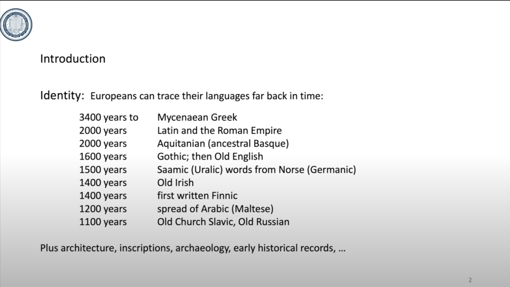 |
| :---------------------------------------------------: |
|                        _00:49_                        |

Доброе утро. Я работаю над ингушским языком уже 45 лет, и мне приятно иметь возможность выступить на этом симпозиуме. Европейцы могут проследить свои языки на очень дальнюю историю, начиная с 3400 лет назад с хеттского и греческого языков, 2000 лет назад с латыни и Римской империи, аквитанского и так далее. По всей Европе, плюс имеются архитектурные остатки с древних времен, надписи, археология, ранние исторические записи и ранняя литература, такая как произведения Гомера.

| 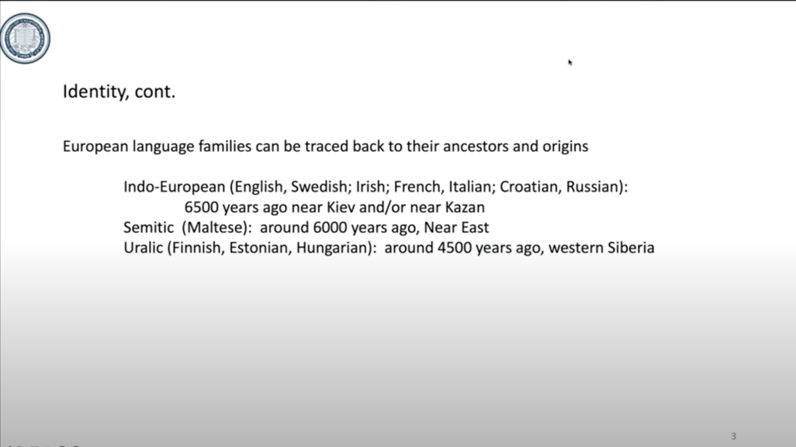 |
| :---------------------------------------------------: |
|                        _01:21_                        |

Также все языковые семьи, представленные в Европе, могут быть прослежены на очень дальние времена. Индоевропейская семья, предшественник английского, шведского, французского, хорватского и многих других языков, возникла около 6500 лет назад, либо в районе Казани, либо в регионе Волго-Камы. Семитская семья, предшественник арабского и иврит, возникла около 6000 лет назад на Ближнем Востоке. Уральская семья, предшественник финского, эстонского, венгерского и многих других, существует около 4500 лет и изначально происходит из Западной Сибири.

| 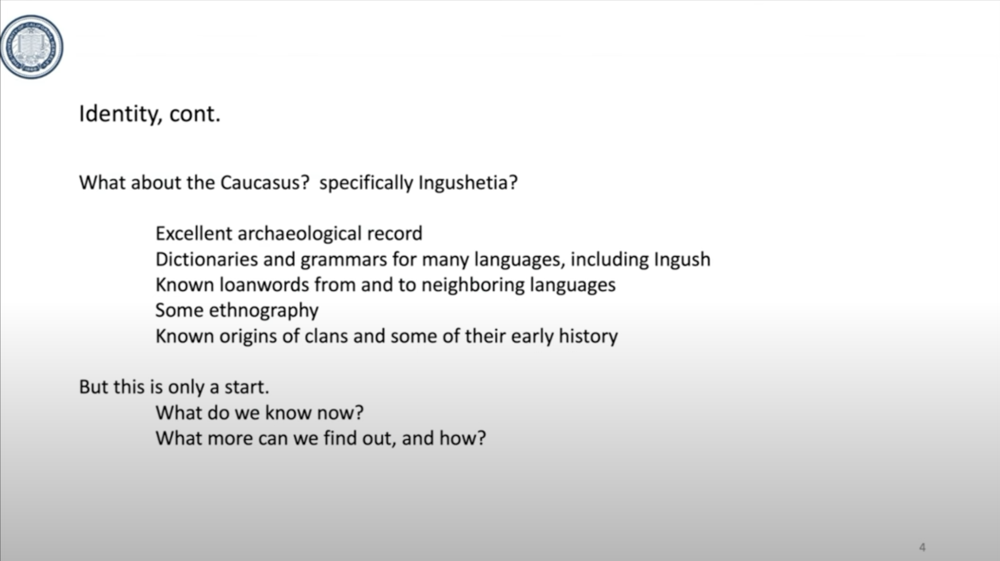 |
| :---------------------------------------------------: |
|                        _02:06_                        |

Но что насчет Кавказа? Что мы можем сказать об этом в контексте Ингушетии? Я поднимаю этот вопрос, потому что он важен для национальной и этнической идентичности, чтобы европейцы могли проследить своих предков или свои языки. Для Ингушетии у нас есть отличная археологическая запись, сохранившаяся в земле и на поверхности, но не так много было изучено. Существуют словари и грамматики для многих языков, включая ингушский, но не все слова, которые переходят из одного языка в другой, говорят нам о том, кто с кем был в контакте и когда. У нас есть некоторые описания этнографии, культуры и так далее. Ингуши хорошо осведомлены о происхождении своих родов и некоторой ранней истории своих кланов, поэтому много чего известно, но это только начало.

Поэтому я собираюсь сообщить о том, что мы сейчас знаем о древней истории ингушей и их языковой семьи, а также о том, что еще нужно узнать.

| 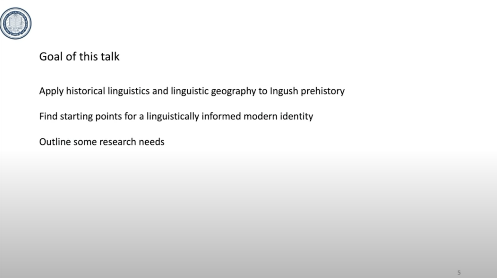 |
| :---------------------------------------------------: |
|                        _03:14_                        |

Я сделаю это, используя историческую лингвистику и лингвистическую географию, чтобы прояснить доисторический период ингушей и найти самые ранние отправные точки для современной идентичности.

| 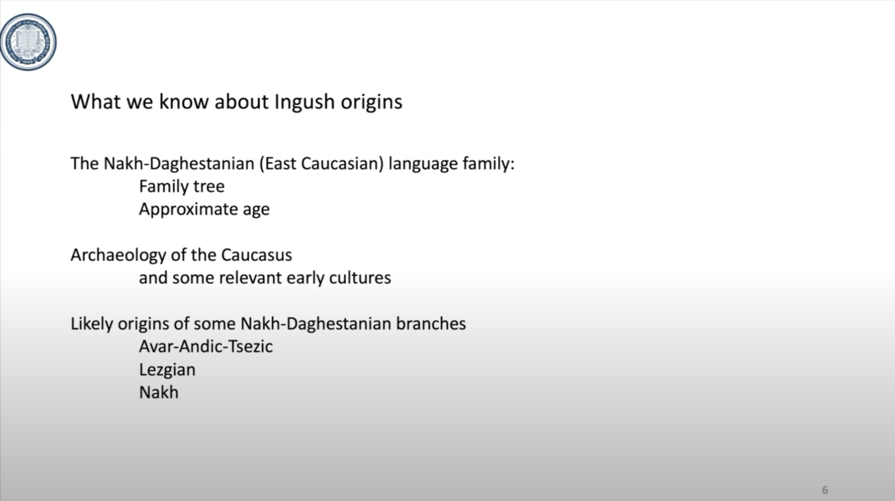 |
| :---------------------------------------------------: |
|                        _03:36_                        |

Итак, вот некоторые вещи, которые мы знаем о происхождении ингушского языка: мы знаем о языковых семьях, с которыми он связан, и о родословной, а также о том, насколько стара эта семья. Мы знаем много о археологии Кавказа, но далеко не все, и мы можем выяснить происхождение некоторых нахских и дагестанских языков, включая нахскую ветвь.

| 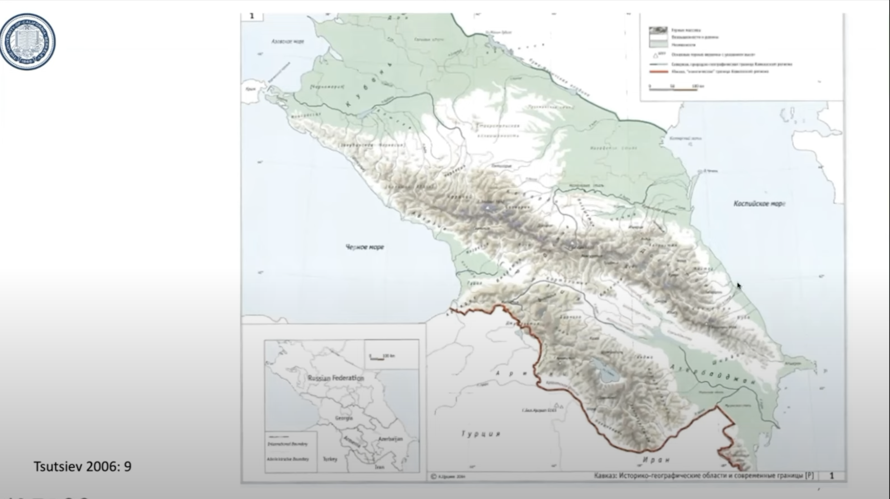 |
| :---------------------------------------------------: |
|                        _04:07_                        |

Вот общий обзор Кавказа. Нахско-дагестанская языковая семья распространена на восточной части, а ингушский язык находится примерно здесь. Важные аспекты — это горный хребет, конечно, и связи между древним Ближним Востоком и древней степью. Эти связи были очень важны, но как они были установлены через горы? Это часть моего беспокойства здесь.

| 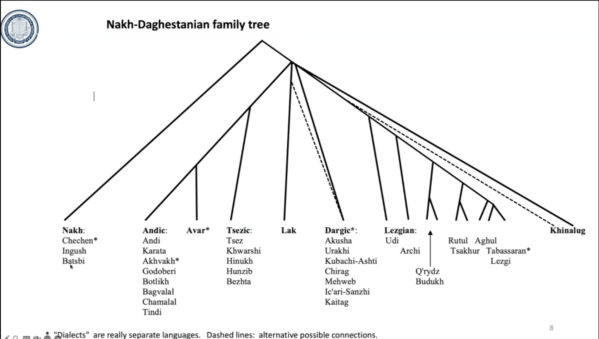 |
| :---------------------------------------------------: |
|                        _04:40_                        |

Вот генеалогическое дерево ингушского языка, здесь находятся его близкие родственники — чеченский и батсбийский, и его более дальние родственники, все они составляют семью, которая, вероятно, существует около 6000 лет, с 30 и более языками в этой семье.

| 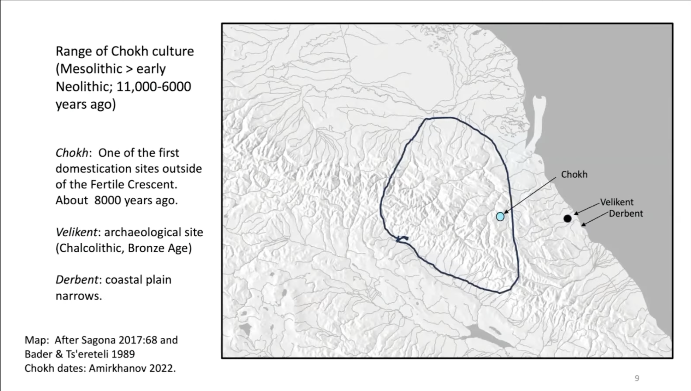 |
| :---------------------------------------------------: |
|                        _05:09_                        |

Вот как далеко мы можем проследить вероятное происхождение этой семьи до того, как сама семья вероятно возникла из одного предка. В мезолитические времена, то есть до появления сельского хозяйства или одомашнивания животных, существовали охотничьи культуры, известные как культура Чоха, названная в честь города Чоха, который находится в ныне авароязычном Дагестане. Это одно из первых мест, где археологически появляются одомашненные растения и животные, поэтому мы можем проследить сельское хозяйство в Европе до города Чоха примерно 8000 лет назад или более. Вот важный археологический памятник бронзового века, современный Великий Кент, и вот еще одно важное место — Дербент. Если вы посмотрите внимательно на форму карты, здесь находятся горы. Прибрежная равнина становится очень узкой; горы подходят почти к океану в Дербенте, а затем снова расширяются. Эта прибрежная равнина является основным связующим звеном между степными культурами Севера и древним Ближним Востоком на Юге.

| 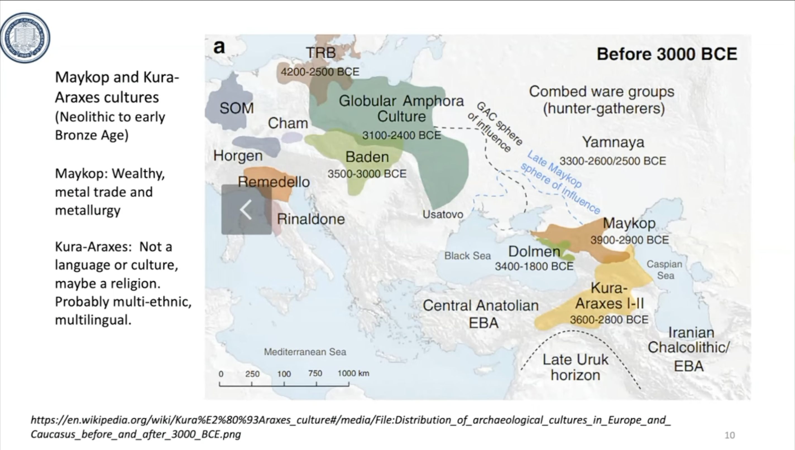 |
| :---------------------------------------------------: |
|                        _06:40_                        |

Вот две из важных ранних сельскохозяйственных культур и культур бронзового века: майкопская культура. Вот Кавказ; майкопская культура на западе была чрезвычайно богатой, занимаясь торговлей металлами, а культура Кура-Аракс на юге и востоке охватывала много нахских и ингушских территорий. Обе эти культуры относятся к бронзовому веку и охватывали обширные земли. Кура-Аракс, вероятно, намного больше диапазона какого-либо одного языка или даже языковой семьи в древности, поэтому, вероятно, здесь говорили на многих языках. Точно сколько, мы не знаем, но вполне вероятно, что предковая нахско-дагестанская речь говорилась где-то здесь. Но где и как, и это, пожалуй, все, что мы знаем.

| 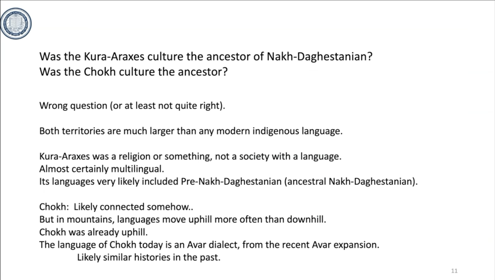 |
| :-----------------------------------------------------: |
|                         _07:45_                         |

Была ли культура Кура-Аракс предшественником современного нахско-дагестанского языка и ингушского? Являлась ли культура Чоха предком? Это не совсем правильный способ задать вопрос. Конечно, есть вопрос, но если вы вспомните карту, показывающую Чох, он находится в аварских высокогорьях. В горных регионах языки поднимаются вверх, поскольку горцы учатся говорить на низинном языке, потому что именно там находятся рынки и зимние рабочие места. Постепенно они склонны переходить на повседневное использование низинного языка, но Чох уже был языком горной местности, и это диалект аварского, поэтому это связано с недавним распространением аварского. Мы не можем утверждать, что Чох является лингвистически предковым языком современных языков.

|  |
| :-----------------------------------------------------: |
|                         _08:53_                         |

Вот карта языков Кавказа, включая картвельский язык, предшественник грузинского, западнокавказские языки, кабардинский и черкесский, и нахско-дагестанские языки здесь, в разнообразных культурах. Вот чеченский и ингушский; вот батсбийский, дальний родственник этих языков, и здесь более удаленно связанные языки, лезгинский, аварский, даргинские языки и другие. Итак, нам нужно выяснить, как перейти от всех этих языков к одному предку и объяснить современные нахские языки.

| 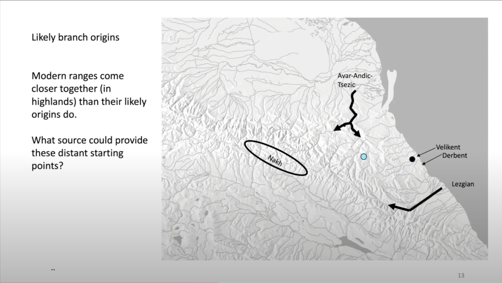 |
| :-----------------------------------------------------: |
|                         _09:36_                         |

Вот что мы можем сказать о происхождении некоторых ветвей этого генеалогического дерева. Нахские языки, кажется, изначально говорились на южном склоне, на южной стороне Кавказа, и распространились в горы оттуда. Аварский язык и его родственники начали с нижнего Сулака и распространились вверх. Это ясно; они распространились далеко вверх. Лезгинская ветвь распространилась вверх вдоль Самура и в конечном итоге населила большую часть Восточного Кавказа. И вот опять Чох, далеко в горах от любого из этих начальных пунктов. Но если мы просто посмотрим на эту карту, вот нах, вот одна ветвь, вот другая ветвь, так что три ветви семьи — их начальные точки очень далеко друг от друга. Как нам перейти от этих начальных точек к одной отправной точке для всей семьи в один момент времени? Это большая загадка, и именно это обсуждают лингвисты и археологи.

| 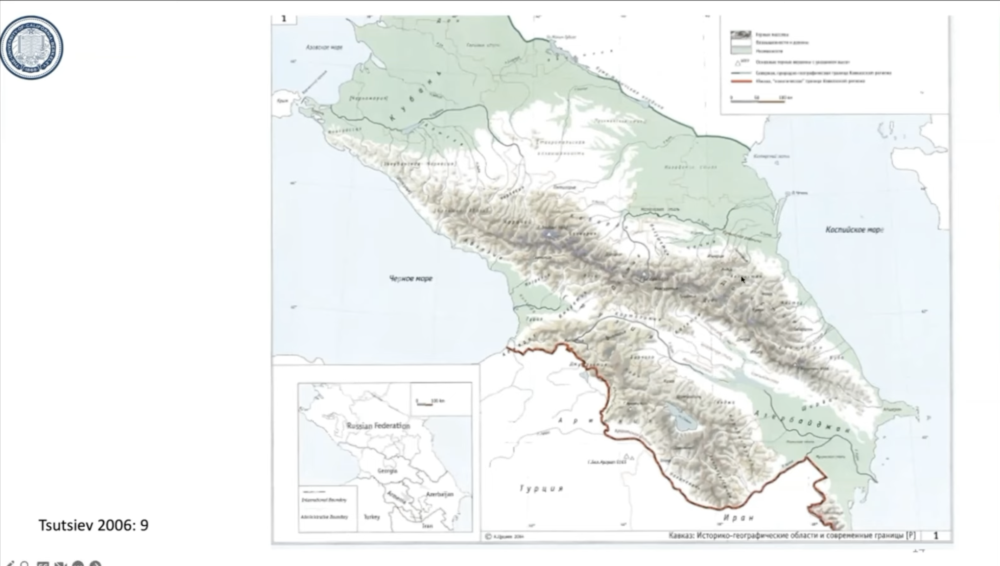 |
| :-----------------------------------------------------: |
|                         _10:46_                         |

Снова взгляните на карту: вот горный массив, который почти полностью блокирует доступ между важными культурами степи на севере и древним Ближним Востоком, где возникло множество нововведений. Как идеи, люди, одомашненные животные и растения и так далее могли пересекать горы? Ответ заключается в том, что они не могли. Не имело смысла пересекать горы через центральный перевал. На самом деле, каравану, например, не было возможности двигаться вдоль побережья Черного моря на западе, потому что там нет прибрежной равнины — горы спускаются прямо к морю. На востоке есть узкая прибрежная равнина, которая представлена зеленой частью, и именно это был путь для транспортировки. Это было установлено археологически. Связи между древним Ближним Востоком и степью в Европе проходили каким-то образом именно здесь. Это нормально, но важно отметить, что здесь расположение Дербента, где прибрежная равнина становится очень узкой; она заблокирована высокими, скальными утесами, и пройти через них сложно. Это возможно, но является настоящим испытанием. Я хочу подчеркнуть, что этот узкий пункт, этот узкий проход, был очень важен для предыстории нахско-дагестанских языков и их носителей.

| 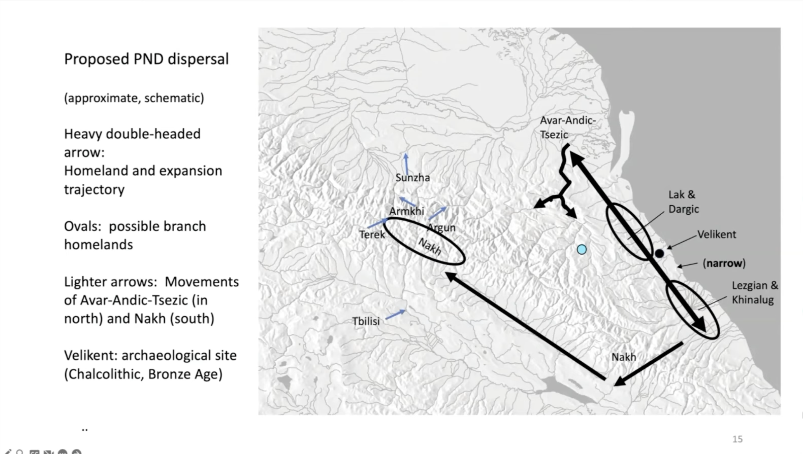 |
| :-----------------------------------------------------: |
|                         _12:26_                         |

Конкретно, вот этот узкий пункт; вот как я вижу родину нахско-дагестанской языковой семьи: это не одна точка, а длинная линия оккупации и контроля. Кто бы ни занимал эту землю, имел возможность видеть, как их язык распространяется дальше, потому что они были важны и контролировали этот узкий проход. Вы можете представить себе своих языковых и культурных предков как тех, кто обеспечивал сбор налогов, поддерживал порядок и собирал налоги с каждого каравана, каждого всадника и каждого пешехода, путешествующего между севером и югом. Еще раз хочу сказать, что таких маршрутов было много, потому что это сообщение было важным, а экономическая связь имела большое значение. Таким образом, ваши языковые предки были важными менеджерами торговли между Севером и Югом.

| 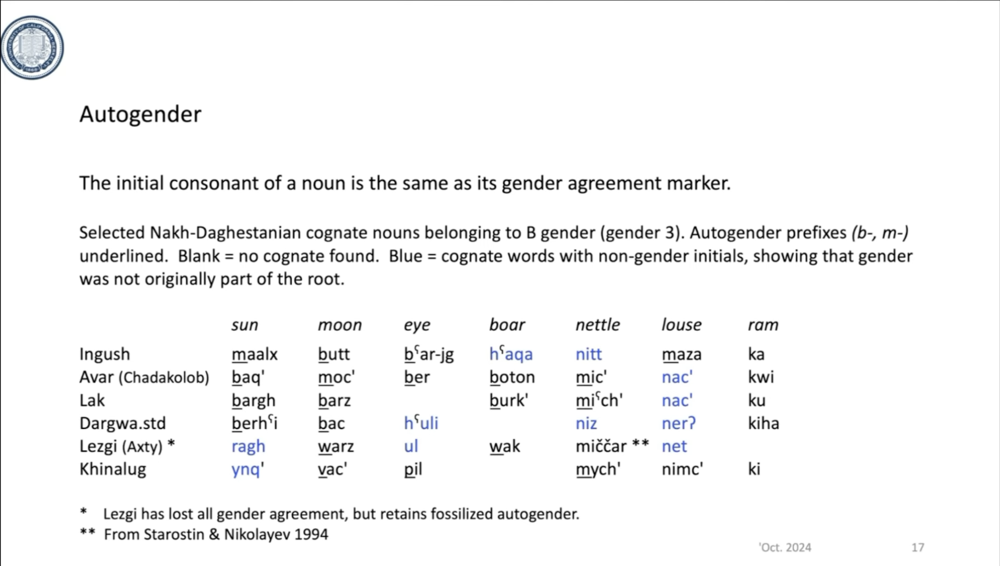 |
| :-----------------------------------------------------: |
|                         _13:48_                         |

Я собираюсь использовать один аспект грамматической структуры — один небольшой момент о грамматической структуре ингушского языка, чтобы поддержать этот анализ. Это то, что я называю "автогендер". Мы все знаем, что такое категория рода в языке, как ингушский. Это согласование глаголов и некоторых прилагательных с каждым существительным. (Ингуш.) И так далее; эти слова согласуются по роду с существительным. Существительное не показывает свой род; его просто нужно выучить. И я вас уверяю, это не легко, но возможно; маленькие дети справляются с этим легко, а взрослым это дается с трудом, но все же возможно.

Вот список слов на ингушском и некоторых его сестринских языках, которые все принадлежат к B-роду. На ингушском это — моя транскрипция "маалх-б, бутт-б, б'ар-жг-б, х'аках-б, нидт-б, мазаб-б, каб". Все они B-рода. Аналогично, все родственные слова в других языках принадлежат тому же B-роду, хотя формы глаголов различаются, а формы существительных — тоже. Но все они происходят от одного и того же предковского слова в протонахско-дагестанском. Я подчеркиваю букву "B", с которой начинаются многие из этих слов, что любопытно. То есть, слово как "бутт" и "б'ар-жг" начинается с буквы "B" в ингушском, как и их маркер рода. Хотя в общем, вы не можете определить род существительного по его звучанию. Если это не "B", они начинаются с "M", что является более близким носовым звуком. И где есть "M" в ингушском, здесь "B" в аварском, и наоборот. Таким образом, это не нормальное звуковое соответствие, что-то интересное происходит. Также есть слова, которые относятся к B-роду, но не начинаются ни с "B", ни с "M". Вот слово на лезгинском "раг", которое не имеет "B" или "M". И слово на хиналугском "ынк'". И вот слово для "барана", которое не имеет "B" или "M" в любом из языков, но тем не менее принадлежит к тому же классу B-рода.

Это любопытно, если вы подумаете о таких языках, как немецкий, французский, русский — они не начинаются с согласного, который обозначает их род. И вообще, вы не можете определить род по звучанию слова.

| 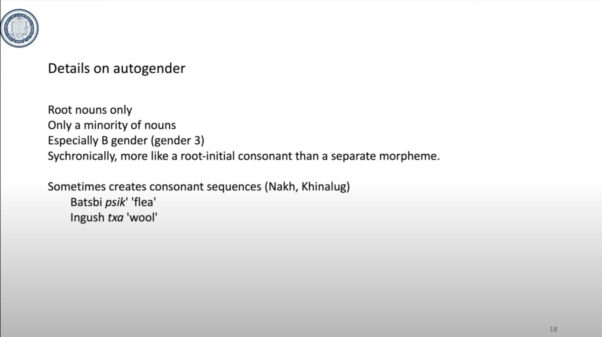 |
| :-----------------------------------------------------: |
|                         _16:33_                         |

Таким образом, это относится к основным существительным и меньшинству из них. Особенно к B-роду. И это первый согласный.

Обратите внимание, что иногда первый согласный создает последовательность из двух согласных, что в целом очень необычно для всей этой языковой семьи. Например, слово для "блохи" — "псик'" на бадзбийском, с "п" в начале. Родственное слово в ингушском и чеченском не имеет "п". Таким образом, на ингушском "сагал" переводится как "блоха". Точно так же слово для "шерсти" — "тха", начинается с "т", что возвращается к "д". Но в других нахско-дагестанских языках это слово не всегда начинается с "д", хотя это его род.

| 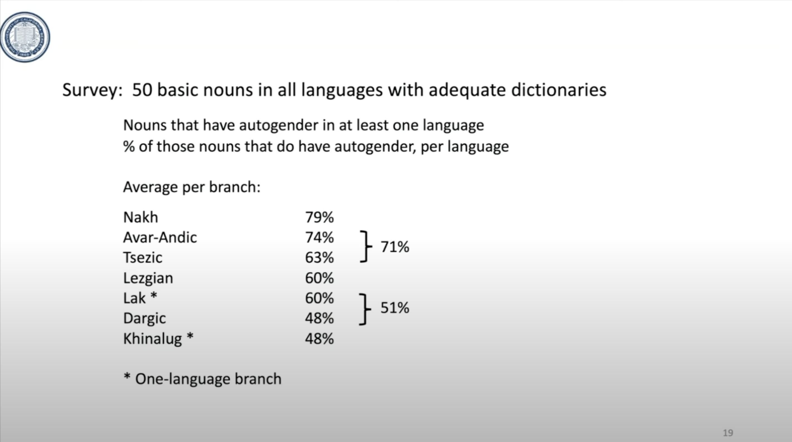 |
| :-----------------------------------------------------: |
|                         _17:20_                         |

Я провела опрос 50 существительных по всем нахско-дагестанским языкам, чтобы узнать, какие из этих существительных имеют автогендер, а какие — нет. Вот результаты: 79%, или подавляющее большинство, имеют автогендер в нахском, но это уменьшается в некоторых языках, а в дагестанском языке очень мало — менее 50%. Эти языки простираются с запада на восток по обе стороны Кавказа, нахский, изначально на юге, аваро-андийский на севере, но оба на западе и так далее. Это интересное географическое распределение, но снова, проценты этих 50 слов, которые я исследовала, сильно варьируются.

| 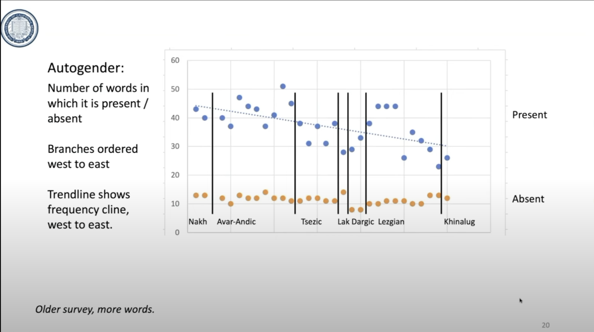 |
| :-----------------------------------------------------: |
|                         _18:12_                         |

Вот график, показывающий те же результаты: синие точки представляют языки с количеством существительных с автогендером, иллюстрируя, что частота уменьшается с запада на восток.

| 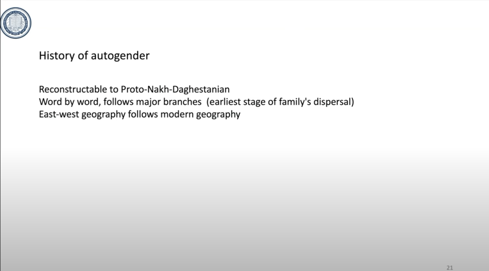 |
| :-----------------------------------------------------: |
|                         _18:43_                         |

Что мы можем сказать об автогендере? Он восходит к предковскому языку, но слово за словом он группируется в ветви, и распределение с запада на восток отражает современную географию. Это иллюстрирует три стадии: предковский язык, основные ветви и их более поздние предки, а также современная география.

| 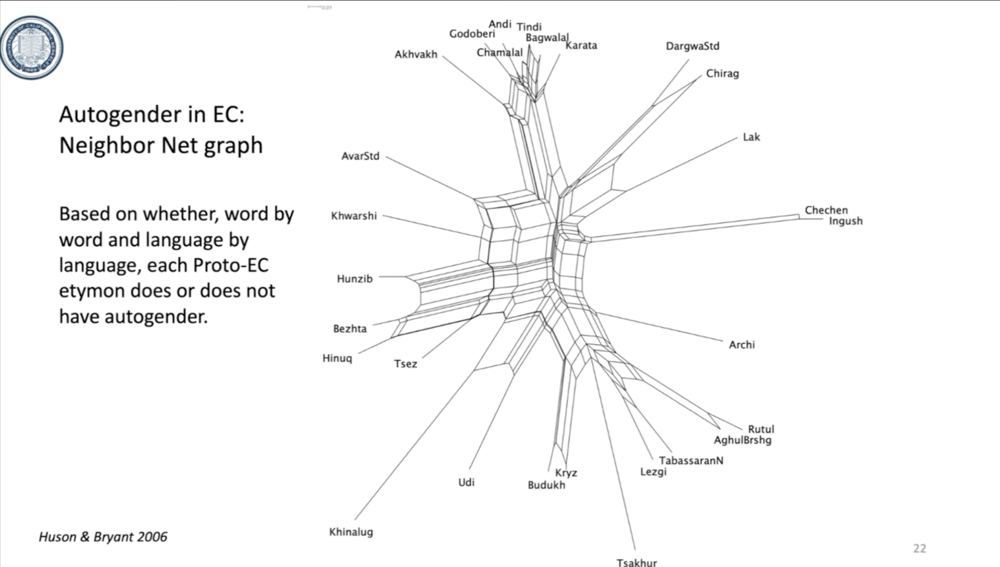 |
| :-----------------------------------------------------: |
|                         _19:08_                         |

Это я пропущу, здесь график, который говорит то же самое о структуре семьи языков.

| 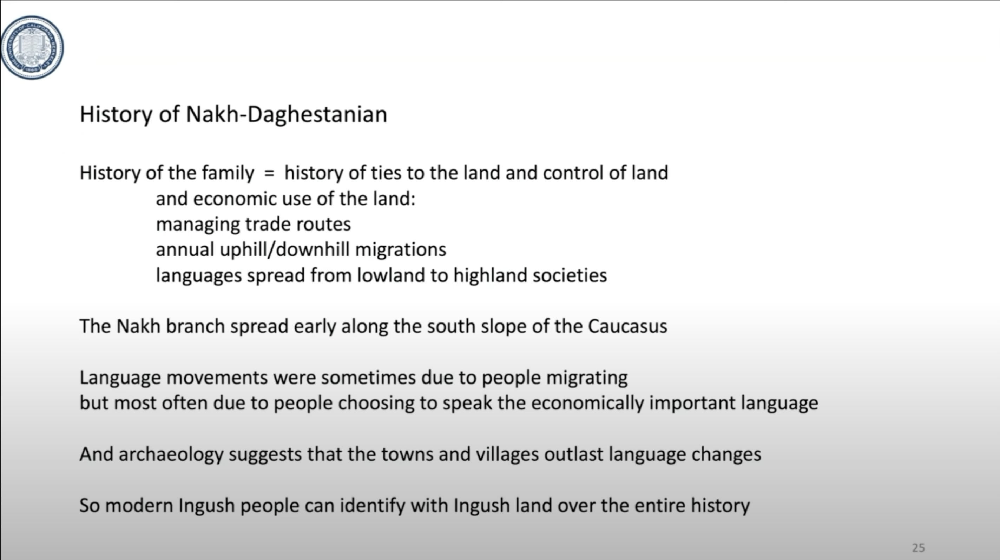 |
| :-----------------------------------------------------: |
|                         _19:25_                         |

Все это вписывается в более широкую историю языковой семьи, которая связана с привязкой к земле и контролю над территорией. Предковский язык распространился именно потому, что его носители контролировали тот узкий проход на восточно-западном маршруте между степью и древним Ближним Востоком. Эти носители использовали землю в своих экономических интересах, управляя торговыми маршрутами. У них также были ежегодные миграции вверх и вниз по склонам, как это происходит и в традиционной экономике, и языки распространялись от низины к возвышенности на протяжении последних нескольких тысяч лет.

Нахская ветвь отделилась рано и распространилась отдельно на юг. Языки распространялись частично потому, что люди перемещались, но в основном потому, что горцы находили полезным говорить на языке низин. Археология показывает, что города и деревни очень древние. Например, говорящий на аварском языке город Чох в дагестанских горах существует примерно 9000 лет, но аварский язык мог появиться там относительно недавно, возможно, только после аварского завоевания восточного Кавказа.

Итак, что мы можем сказать о современной ингушской идентичности? Современные ингуши могут идентифицировать себя с местами и землей, а также с людьми, которые эффективно использовали эту землю. Они принимали решения о том, на каком языке говорить; сегодня этот язык — ингушский, который на этой территории давно употребляется предками ингушей. Их генетические и археологические связи восходят как минимум к языку, если не раньше. Таким образом, эта древняя идентичность довольно хорошо установлена, хотя нам все еще нужно провести много археологических и лингвистических исследований. Спасибо за внимание.
