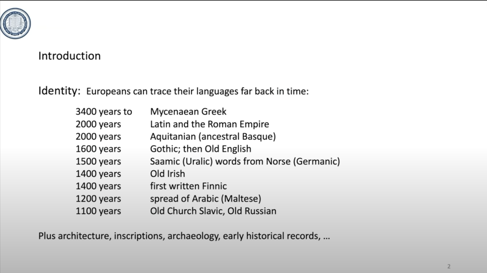
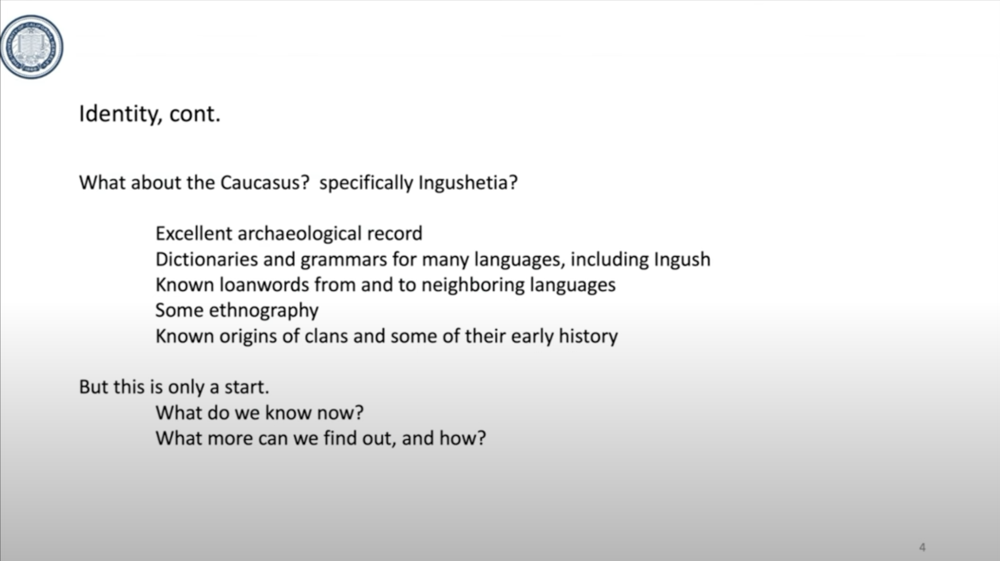
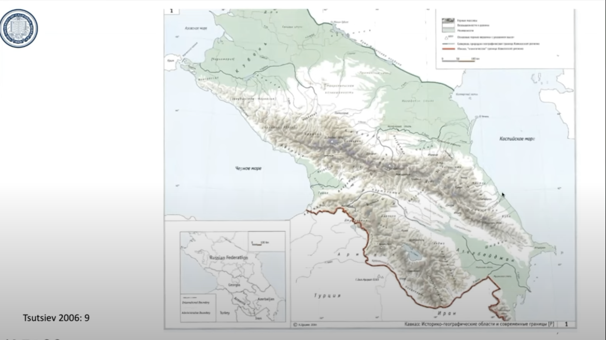
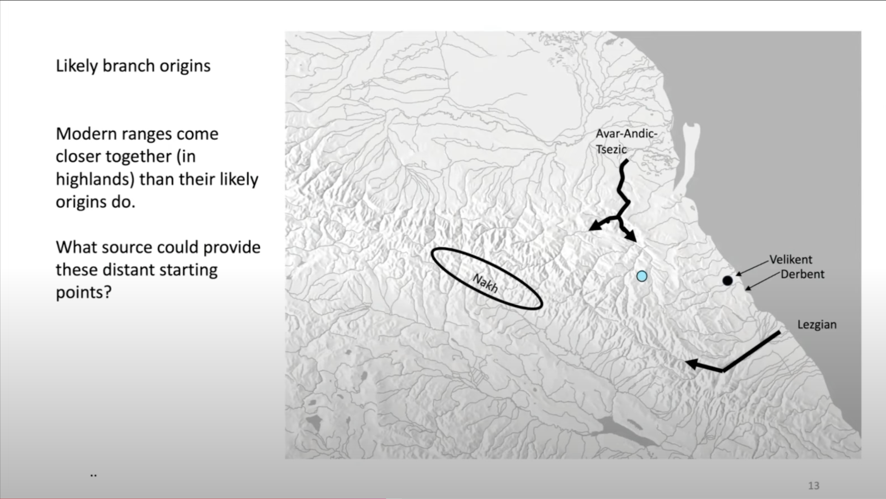
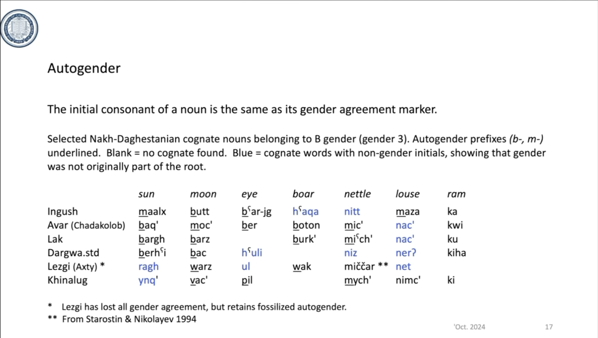
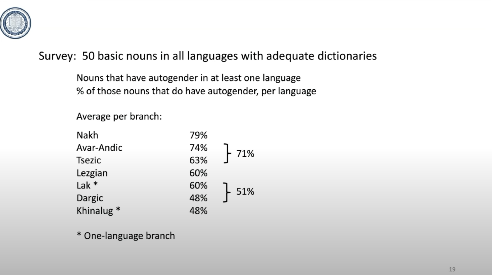
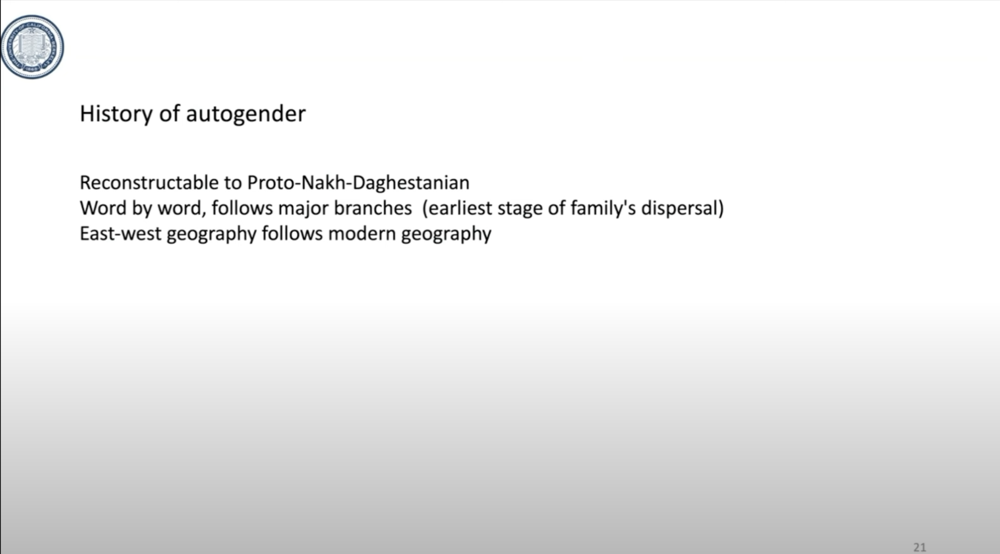
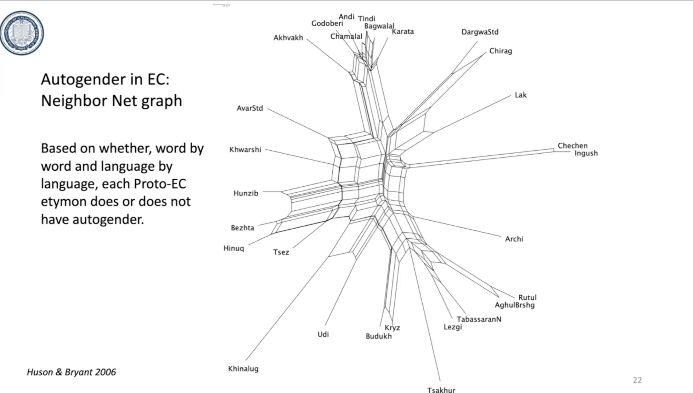

|  |
| :-----------------------------------------------------------------------------------------------------------------: |
|                    [_Click to watch youtube video_](https://www.youtube.com/watch?v=HOe71L3Kbj4)                    |
|             [_Нажмите, чтобы посмотреть видео на YouTube_](https://www.youtube.com/watch?v=HOe71L3Kbj4)             |

## English Transcript

|  |
| :---------------------------------------------------: |
|                        _00:49_                        |

Good morning, as it is here in California. I have been working on the Ingush language for 45 years, and I'm glad to have a chance to address this symposium. Europeans can trace their languages back very far in time, as long ago as 3,400 years to Hittite and Greek, 2,000 years to Latin and the Roman Empire, and Aquitanian, and so on. All across Europe, plus there are architectural remains from ancient times, inscriptions, archaeology, early historical records, and early literature, such as the works of Homer.

|  |
| :---------------------------------------------------: |
|                        _01:21_                        |

Also all of the language families represented in Europe can be traced back very far. The Indo-European family, ancestral to English, Swedish, French, Croatian, and many others, arose about 6,500 years ago either near Kazan or in the Volga-Kama region. The Semitic family, ancestral to Arabic and Hebrew, arose about 6,000 years ago in the Near East. The Uralic family, ancestral to Finnish, Estonian, Hungarian, and many more, is about 4,500 years old and originally comes from Western Siberia.

|  |
| :---------------------------------------------------: |
|                        _02:06_                        |

But what about the Caucasus? What can we say along those lines about Ingushetya? I bring this point up because it's an important point of national identity and ethnic identity for Europeans to trace their ancestors back or to be able to trace their language back. For Ingushetya, we have an excellent archaeological record preserved in the soil and on the ground, but not much has been studied. There are dictionaries and grammars for many languages, including Ingush, but not all words that have gone to and from between languages tell us who has been in contact with whom, and when. We have some description of ethnography, culture, and so forth. The Ingush people know a lot about the origins of their clans and some of the early history of their clans, so a lot is known, but this is only a start.

So I'm going to report on what we do know now about the ancient history of Ingush and its language family and what more we need to know.

|  |
| :---------------------------------------------------: |
|                        _03:14_                        |

I will do this by using historical linguistics and linguistic geography to shed light on Ingush prehistory and find the earliest starting points for modern identity.

|  |
| :---------------------------------------------------: |
|                        _03:36_                        |

So here are some things we do know about the origin of Ingush: we know about the language families that it's related to and the family tree, and about how old that family is. We know a lot about the archaeology of the Caucasus, but by no means everything, and we can figure out the origins of some of the Nakh-Daghestanian languages, including the Nakh branch.

|  |
| :---------------------------------------------------: |
|                        _04:07_                        |

Here is an overview of the Caucasus. The Nakh-Daghestanian language family is spoken over the eastern part, and Ingush is approximately here. Important things are the mountain range, of course, and the connections between the ancient Near East and the ancient steppe. Those connections were very important, but how were they made over the mountains? That's part of my concern here.

|  |
| :---------------------------------------------------: |
|                        _04:40_                        |

Here is the family tree for the Ingush language, down here, and its close relatives, Chechen and Batsbi, and its more distant relatives, all of which make up a family that is probably about 6,000 years old, with 30 or more languages in that family.

|  |
| :---------------------------------------------------: |
|                        _05:09_                        |

Here is how far we can trace the likely origin of that family back to before the actual family itself is likely to have arisen from one ancestor. In Mesolithic times, that is, before there was any agriculture or animal domestication, so hunting cultures, we have what's known as the Chokh culture, named for the town of Chokh in what is now Avar-speaking Dagestan. This is one of the first places where domesticated plants and animals appear archaeologically, so we can trace agriculture in Europe back to the town of Chokh about 8,000 years ago or more. Here's an important Bronze Age archaeological site, modern-day Velikent, and here is another important spot, Derbent. If you look closely at the shape of the map, these are the mountains over here. There is a coastal plain that gets very narrow; the mountains come down almost to the ocean at Derbent and then widen out again. This coastal plain is the main connection between the steppe cultures of the North and the ancient Near East to the South.

|  |
| :---------------------------------------------------: |
|                        _06:40_                        |

Here are two of the important early agricultural cultures and Bronze Age cultures: the Maykop culture. Here's the Caucasus; the Maykop culture in the west was extremely wealthy, trading in metals, and the Kura-Araxes culture in the south and east included a lot of Nakh-Daghestani and Ingush territory. These are both Bronze Age cultures, and they covered a great deal of land. The Kura-Araxes culture is probably much larger than the range of any one language or even language family in ancient times, so probably many languages were spoken here. Exactly how many, we don't know, but it's quite likely that ancestral Nakh-Dagestanian was spoken around in here somewhere. But where and how, and that's about all we know.

|  |
| :-----------------------------------------------------: |
|                         _07:45_                         |

Was that Kura-Araxes culture ancestral to modern Nakh-Daghestanian and to Ingush? Was the Chokh culture the ancestor? This is not quite the right way to put the question there. There is certainly a question, but if you recall the map showing Chokh, it's in the Avar-speaking Highlands. In mountainous regions, languages move uphill as mountaineers learn to speak the lowland language because that's where the markets are and the winter employment. They gradually are inclined to shift over to everyday use of the lowland language, but Chokh was already an uphill language, and it's a dialect of Avar, so it's due to the recent spread of Avar. We can't say Chokh is linguistically ancestral to the modern languages.

|  |
| :-----------------------------------------------------: |
|                         _08:53_                         |

Here is a map of the languages of the Caucasus, including Kartvelian, ancestral to Georgian, the West Caucasian languages, Kabardian and Circassian, and the Nakh-Daghestanian languages over here in a variety of different cultures. Here are Chechen and Ingush; here is Batsbi, a distant relative of those, and here are the even more distantly related languages, Lezgian, Avar, the Dargi languages, and others. So we have to figure out how to get from all of these to one ancestor and account for the modern-day Nakh languages.

|  |
| :-----------------------------------------------------: |
|                         _09:36_                         |

Here is what we can say about the origins of some of the branches of that family tree. The Nakh languages seem to have originally been spoken on the south slope, the south side of the Caucasus, and to have spread into the mountains from there. The Avar language and its relatives started out on the lower Sulak and spread uphill. This much is clear; they spread far uphill. The Lezgian branch spread uphill along the Samur and eventually populated a lot of the East Caucasus. And here again is Chokh, far uphill from any of these beginnings. But if we just look at this map, here’s Nakh, here’s one branch, here’s another branch, so three branches of the family— their starting points are very far apart. How do we get from those starting points to one starting point for the whole family at one point? That's the big puzzle here, and that's what is debated by linguists and archaeologists.

|  |
| :-----------------------------------------------------: |
|                         _10:46_                         |

Again, look at the map; here's the mountain range pretty much blocking access between the important cultures of the steppe to the north up here and farther north, and the ancient Near East, where many innovations arose. How did ideas, people, domesticated animals and plants, and so forth, move across the mountains? The answer is they didn't. It was not worthwhile to cross the mountains in the central pass. It was not really possible for a caravan, for instance, to go along the Black Sea Coast in the west because there's no coastal plain— it's mountains going all the way down to the sea. In the east, there is a narrow coastal plain that is this green part, and that was the route of transport. This has been established archaeologically. Connections between the ancient Near East and the steppe in Europe went along here somehow. That is fine, but importantly, here is the location of Derbent, where the coastal plain becomes very narrow; it's blocked off by high, rocky cliffs, and it's hard to get through. It's possible, but it's a challenge. My point is this: this narrow point, this constriction point, was very important for the prehistory of the Nakh-Daghestanian languages and their speakers.

|  |
| :-----------------------------------------------------: |
|                         _12:26_                         |

Specifically, here's the narrow point; here is how I envision the homeland of the Nakh-Daghestanian family: not a single point, but a long line of occupation and control. Whoever occupied this land was in a position to see their language spread beyond because they were important, and they controlled that narrow pass. You can think of your linguistic and cultural ancestors as staffing the taxation point, enforcing law and order, and collecting taxes from every caravan and every rider, and every pedestrian traveling between north and south. Once again, there were many such because that communication was important, and that economic connection was very important. So your linguistic ancestors were important managers of the trade between North and South.

|  |
| :-----------------------------------------------------: |
|                         _13:48_                         |

I'm going to use one point of grammatical structure—one small point about Ingush grammatical structure—to support that analysis. This is what I call "autogender." We all know what the category of gender is in a language like Ingush. It's the agreement of verbs and some adjectives with every noun. (_Ingush_) So on and so forth; those words agree in gender with the noun. The noun does not show its gender; you just have to learn it. And I assure you, this is not easy, but it's possible; it's done easily by babies and with difficulty by adults, but it can be done.

Here is a list of words in Ingush and some of its sister languages, which all belong to the B-gender. In Ingush, they are this — my transcription is "maalx-b, butt-b, b'ar-jg-b, h'aqa-b, nitt-b, maza-b, ka-b" —they're all B-gender. Likewise, all of the cognate words in other languages belong to that same B-gender, though the verb forms are different, and the noun forms are different. But these all descend from the same ancestral word in Proto-Nakh-Daghestanian. I've underlined the "B" that many of these words begin with, which is curious. That is, a word like butt and b'ar-jg, begin with the letter B in Ingush, the same as their gender marker. Though in general, you cannot judge the gender of a noun from its sound. If not a B, they start with an M, which is the closer related nasal sound. And where there is an M in Ingush, there is a B in Avar here, and vice-versa here. So this is not a normal sound correspondance, something interesting was going on. There are also words in here which belong to B gender, but do not have either a B or an M at the beginning. Here is a Lezgi word, ragh, which has no B or M. And a Khinalug word, ynq'. And here is word for ram, which does not have a B or an M, in any of the languages, but nonetheless belongs to the same B gender class.

That is a curious thing if you think about languages like German, French, Russian, they do not start with a consosant that marks their gender. And in general, you cannot tell the gender from the sound of a word.

|  |
| :-----------------------------------------------------: |
|                         _16:33_                         |

So this applies to basic nouns and the minority of them. And especially to B-gender. And it is the first consonant.

Notice that sometimes the first consonant sets up a sequence of two consonants, which is otherwise very unusual in this whole language family. For example, the word for "flea" is "psik'" in Batsbi, with a "p" at the beginning. The cognate in Ingush and Chechen does not have the "p". So in Ingush "sagal" translates to "flee." Similarly, the word for "wool", txa, begins with a "t," which goes back to a "d,". But in other Nakh-Daghestanian languages, the word does not always start with a "d," although that's its gender.

|  |
| :-----------------------------------------------------: |
|                         _17:20_                         |

I conducted a survey of 50 nouns across all Nakh-Daghestanian languages to see which of those nouns do and do not have autogender. Here are the results: 79%, or the large majority, have autogender in Nakh, but this decreases in some languages, and finally, in the Dargi language, it is very few—less than 50%. These languages run from west to east on both sides of the Caucasus, Nakh, originally in the south, Avar-Andic in the north as well, but both in the west, as so forth. It's an interesting geographical distribution, but again, the percentages of those 50 words I surveyed vary a lot.

|  |
| :-----------------------------------------------------: |
|                         _18:12_                         |

Here’s a graph showing the same findings: the blue dots represent languages with their numbers of autogender nouns, illustrating that the frequency decreases from west to east.

|  |
| :-----------------------------------------------------: |
|                         _18:43_                         |

What can we say about autogender? It traces back to the ancestral language, but word by word, it clusters into branches, and the east-west distribution reflects modern geography. This illustrates three stages: the ancestor language, the major branches, and their later ancestors, along with modern geography.

|  |
| :-----------------------------------------------------: |
|                         _19:08_                         |

This I will skip over, it is a graph saying the same thing about the family structure.

|  |
| :-----------------------------------------------------: |
|                         _19:25_                         |

All of this fits into the larger history of the language family, which relates to ties to the land and control of the territory. The ancestral language spread out precisely because its speakers controlled that narrow pass on the east-west route between the steppe and the ancient Near East. These speakers utilized the land to their economic advantage by managing trade routes. They also had annual migrations uphill and downhill, as the traditional economy still does, and languages have spread from downhill to uphill for the last several thousand years.

The Nakh branch separated early and spread separately out in the south. Languages spread partly because people moved but mainly because Highlanders found it beneficial to speak the lowland language. Archaeology tells us that towns and villages are very old. For example, the Avar-speaking town of Chokh in the Dagestan highlands is approximately 9,000 years old, but the Avar language may have arrived there relatively recently, perhaps only since the Avar conquest of the eastern Caucasus.

So, what can we say about modern Ingush identity? The modern Ingush people can identify with places and land, as well as with people who made good economic use of that land. They made decisions about which language to speak; today, that language is Ingush, which has been spoken in the area for a long time by the ancestors of the Ingush people. Their genetic and archaeological connections trace back at least as far as the language, if not earlier. Thus, this ancient identity is fairly well established, though we still need a lot of archaeological and linguistic research to be done. Thank you for your attention.
